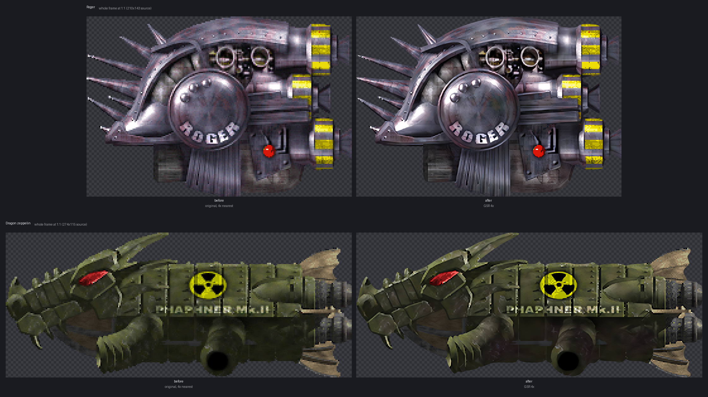
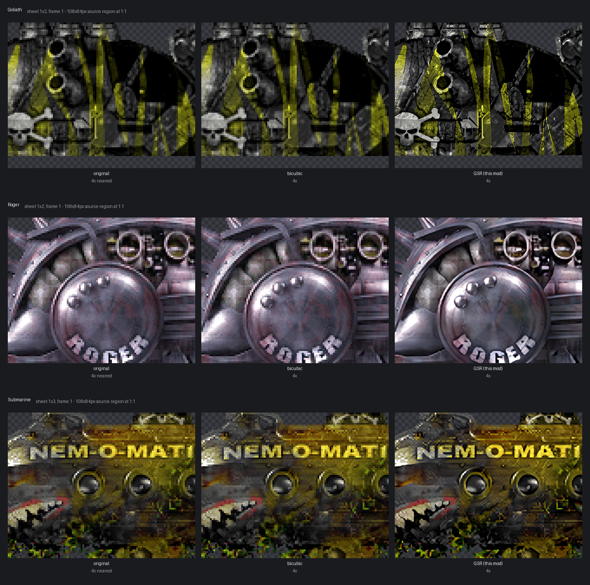
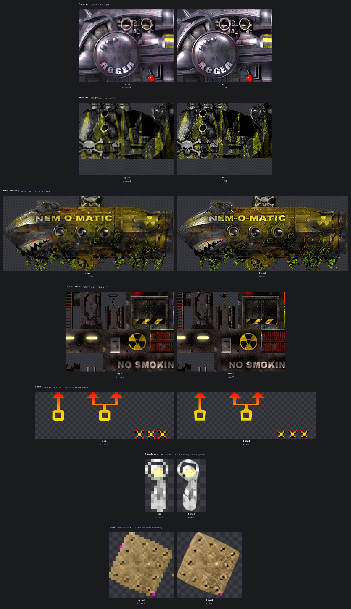
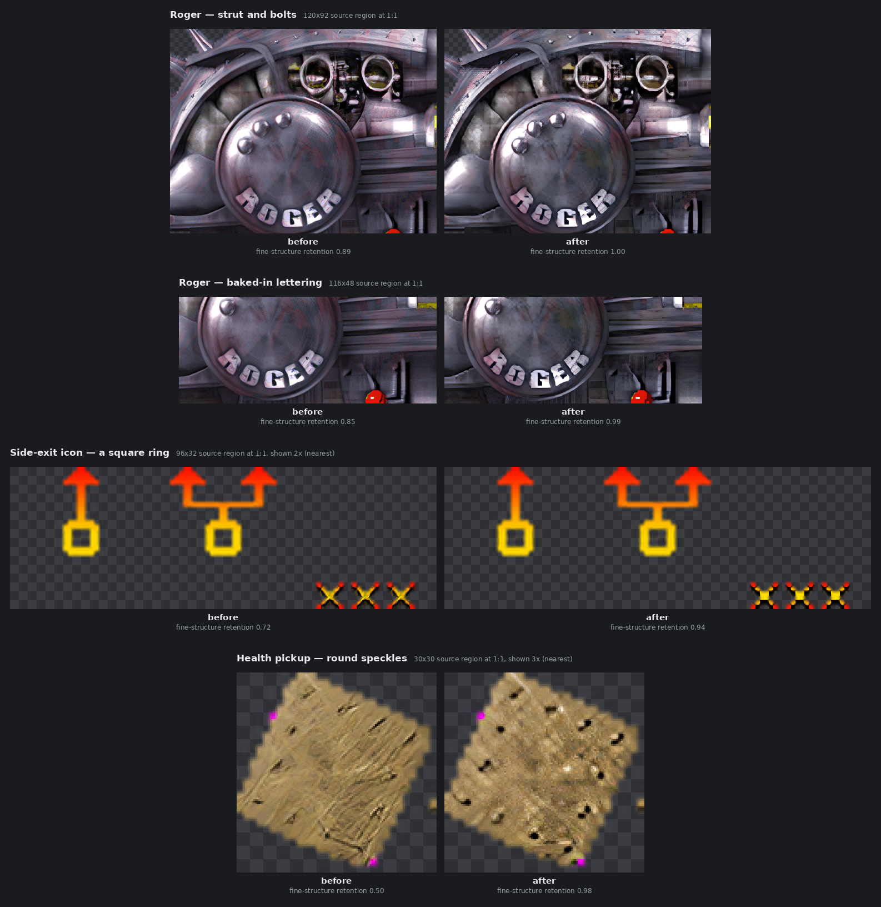
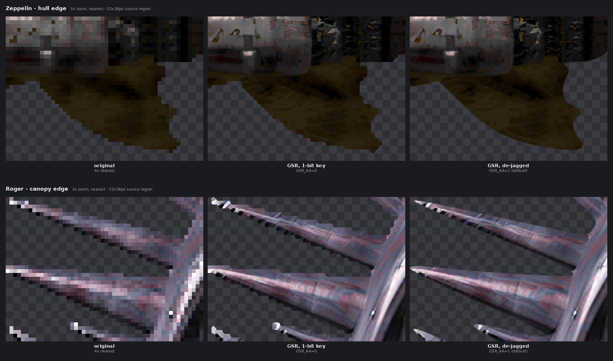

# Jets'n'Guns Gold — HD + Widescreen Mod

A mod for the **Steam build of Jets'n'Guns Gold (v1.308 ST)** — **Linux and Windows** — that:

- adds **true 16:9 widescreen** (Hor+ — you see more to the sides, HUD stays correct), and
- renders every sprite, texture and effect from **4× AI-upscaled art** at the correct
  on-screen size, so the 20-year-old graphics look crisp on a modern display.

It is delivered as a **non-destructive overlay** plus a tiny binary patch — the original
`jng.dat` is never touched, and everything is fully reversible.



*Left: the original art at 4× nearest-neighbour, i.e. what a naive blow-up looks like.
Right: this mod. Both are one frame of a sprite sheet, shown at 1:1 with the 4× output.*

The game's art is not one kind of thing — a 1024 px level backdrop and a 10 px-wide walking
sprite are different problems — so see **[the current-state gallery](#what-every-asset-type-looks-like-now)**
for one before/after per asset category.

> ⚠️ You must own Jets'n'Guns Gold. This repo contains **only tooling and docs** — it builds
> everything from your own copy of the game and never redistributes the game's files or art
> (© Rake in Grass). Shared **non-commercially with the developers' blessing**; do not sell it
> or anything built with it.

---

## Prerequisites

You don't need to be a programmer to build this — the script does the work — but a few free
tools have to be present first. You need **three** things (plus a GPU driver you almost
certainly already have):

1. **Jets'n'Guns Gold**, installed from Steam. (You must own it.)
2. **Python 3.10 or newer** — the language the build tool is written in.
3. **Git** — to download this repo. *(Optional: you can instead click the green **Code ▸
   Download ZIP** button on the repo page and unzip it, and skip Git entirely.)*

Your GPU needs a normal, up-to-date graphics driver (that's all "Vulkan" requires — no extra
downloads). Any AMD/NVIDIA/Intel card from the last decade works.

### Install the tools

**Windows** — open **PowerShell** (press Start, type "PowerShell", hit Enter) and paste:

```powershell
winget install Python.Python.3.12
winget install Git.Git
```

Then **close and reopen PowerShell** so it picks up the new commands.

**Linux** — use your distro's package manager, e.g. on Debian/Ubuntu:

```bash
sudo apt install python3 python3-venv git curl unzip
```

---

## Quick start

### Windows

In PowerShell, run these one at a time. Replace the path on the 3rd line with **your** game
folder if the game isn't on your C: drive (a `D:\SteamLibrary` is common — in Steam, right-click
the game ▸ *Manage* ▸ *Browse local files* to see where it is):

```powershell
git clone https://github.com/kirillinda/jng-gold-hd jng-gold-hd
cd jng-gold-hd
$env:JNG_GAME_DIR = "D:\SteamLibrary\steamapps\common\JnG Gold"
powershell -ExecutionPolicy Bypass -File build.ps1
```

*(The `-ExecutionPolicy Bypass` part just lets Windows run the script this once; it doesn't
change any system settings. If you downloaded the ZIP instead of using Git, skip the first line
and `cd` into the unzipped folder.)*

The first build takes a few minutes — it downloads the AI upscaler and model, unpacks your
game's art, upscales ~1,900 images on your GPU, and packs everything.

### Linux

```bash
git clone https://github.com/kirillinda/jng-gold-hd jng-gold-hd && cd jng-gold-hd
./build.sh                        # downloads the upscaler + default model, builds everything
```

The build produces two folders under `dist/`:

| Folder | What it is |
| --- | --- |
| `dist/mod-dropin/` | **Only the changed files** — the patched game binary, `hd.dat`, `Data.ini` + an installer. Copy into your game folder for a drop-in install. |
| `dist/patched-game/` | A **complete, ready-to-run** copy of the patched game. |

Install the drop-in:

**Windows** — from `dist\mod-dropin\`, with the game closed:

```powershell
powershell -ExecutionPolicy Bypass -File install.ps1 -GameDir "D:\SteamLibrary\steamapps\common\JnG Gold"
```

`install.ps1` backs up the originals to `*.orig`, installs the patched files, and enables
widescreen in your `Documents\JnGGold\Game.ini`. `uninstall.ps1` restores everything. Then
launch the game from Steam as usual.

**Linux** — from `dist/mod-dropin/`:

```bash
./install.sh "$HOME/.local/share/Steam/steamapps/common/JnG Gold"
```

`install.sh` backs up the originals to `*.orig`; `uninstall.sh` restores them.

### Choosing the upscale model

```powershell
.\build.ps1                          # default: 4x_NMKD-Siax_200k (sharp, detailed)
.\build.ps1 -Model realesrgan-x4plus # any model present in tools/upscaler/models/
```

```bash
./build.sh                      # default: 4x_NMKD-Siax_200k
./build.sh realesrgan-x4plus    # any model present in tools/upscaler/models/
```

If you pass a model name, it must already be in `tools/upscaler/models/` as a
`NAME.param` + `NAME.bin` pair (grab more from
[openmodeldb.info](https://openmodeldb.info) or the
[Upscayl models](https://github.com/upscayl/custom-models)). With no argument, the default
model is downloaded automatically. Results are cached per-model, so switching is cheap.

---

## Requirements (reference)

The [Prerequisites](#prerequisites) section above has the step-by-step install. In short:

- The Steam build of **Jets'n'Guns Gold 1.308 ST** (Linux or Windows).
- **Python 3.10+** and (optionally) **Git**.
- For the **default HD backend (GSR):** **Docker** + an **AMD GPU with ROCm** (developed on
  an AMD RX 7900 XTX). The ROCm/PyTorch toolchain lives entirely inside the container — no ML
  packages on your host.
- For the **legacy ncnn backend** (`HD_BACKEND=ncnn`): any **Vulkan-capable GPU** (AMD/Intel/
  NVIDIA) with an up-to-date driver; no CUDA/ROCm/Docker needed.

Everything else (the upscaler, the LZO codec, the Python image libraries) is fetched
automatically — no system packages to install by hand.

---

## Repository layout

```
build.sh / build.ps1     one-shot builders (Linux / Windows; see top of file for options)
tools/
  config.py              paths / parameters (env-overridable; OS-aware defaults)
  jngdat.py              reader + writer for the game's LZO .dat archives
  extract.py             unpack the .dat archives into assets/
  upscale.py             legacy ncnn upscaling pipeline (transparency-aware)
  build_batch.py         legacy ncnn: upscale every asset 4x and pack build/hd.dat
  gsr/                   default HD backend — GPU super-resolution (see below)
    Dockerfile           ROCm 7.x + PyTorch + spandrel image (self-contained)
    build_hd_gsr.py      sheet-aware GAN upscaler -> build/hd.dat
    run.sh               build the image + run the upscale in the container
    lab.py               A/B any upscaler settings side by side, with scores
    verify_hd.py         check hd.dat: valid archive, every image exactly 4x
    scan_quality.py      check hd.dat for upscale corruption (alpha-aware)
    scan_detail.py       rank the archive by how much fine structure survived
    verify_sdl_bmp.py    prove our 32-bit BMPs load with alpha in the real SDL2
    make_showcase.py     regenerate the before/after + asset-gallery figures
    models/              GAN model weights (git-ignored; fetched from HuggingFace)
  patch_hd.py            binary-patch the game (auto-detects Windows PE / Linux ELF)
  patch_widescreen.py    binary-patch the leftover hardcoded 800x600 gameplay bounds (ELF)
  make_widescreen_defs.py  re-author the 800-wide level defs for the target width (ws.dat)
  scan_levels.py         simulate every spawn chain in every level at 800 vs the target
                         width; finds the pop-ins / mid-air despawns the sweep fixes
  make_gamecfg.py        generate a widescreen Game.cfg (Linux)
  install.sh / install.ps1      drop-in installer   (Linux / Windows)
  uninstall.sh / uninstall.ps1  drop-in uninstaller (Linux / Windows)
assets/                  the game's unpacked art (GENERATED from your own game copy;
                         git-ignored — never redistributed)
docs/HOW_IT_WORKS.md     full technical write-up (engine internals + why the patch works)
```

Regenerable/large/proprietary things (`tools/venv/`, `tools/upscaler/`, `upscaled/` cache,
`build/`, `dist/`, and the game's `assets/` + binaries) are git-ignored. The repo ships only
the tooling and docs — you build everything from **your own** legally-owned copy of the game.

---

## Editing the art yourself

The build unpacks your game's art into `assets/DATA/...` on first run (or run
`tools/venv/.../python tools/extract.py` manually). Edit any `.bmp/.jpg/.tga` there (keep the
magenta `255,0,255` background as the transparent key for sprites), then re-run the build —
only changed files are re-upscaled and repacked. `assets/` is git-ignored, so your edits stay
local and the game's copyrighted art is never committed.

The **upscaled** art is also editable. It lands in `upscaled_gsr/<model>_aa/` and every file
is a genuine image in the container its extension claims: anti-aliased sprites are 32-bit
BMPs with a `BITMAPV4HEADER` alpha mask, so they open in GIMP, Krita or a plain image viewer.
(Earlier builds wrote TGA bytes to `.bmp` paths — the engine accepted that, because
`CRXTexture::Load` falls back to `IMG_LoadTGA_RW` when SDL2 can't sniff the format, but no
image viewer would open them.) `tools/gsr/verify_sdl_bmp.py` drives the real libSDL2 through
`ctypes` to confirm the alpha survives the exact load path the game uses.

---

## HD art backend (GSR — the default)

The art is upscaled by a modern **GAN super-resolution** model (`4x-UltraSharpV2`,
RealPLKSR/DAT2) run through **PyTorch + spandrel** on the GPU, inside a self-contained
**ROCm 7.x Docker container** — nothing is installed on your host. This replaces the old
`realesrgan-ncnn` + `4x_NMKD-Siax` path, whose output was soft/"soapy". The pipeline is
sprite-engine-aware, which is what makes the result usable in-game rather than just "an
upscaled PNG":



*The most detailed region of three sprites, at 1:1 with the 4× output. Bicubic smooths the
pixel grid but invents no detail; the GAN reconstructs plausible surface texture — panel
grain on the Goliath's armour, the machined bevel around Roger's emblem, corrosion on the
submarine hull.*

### What every asset type looks like now

The pipeline behaves very differently by asset class, so this is the honest whole-set view
rather than a flattering pick: one row per category, original 4× nearest against what ships
today, all at 1:1 (the small ones magnified with nearest-neighbour, so they are still real
output pixels).



Measured across the archive with `tools/gsr/scan_detail.py` — fine-structure retention,
where 1.0 means the source's small detail survived the upscale:

| | before this work | now |
|---|---|---|
| median retention | 0.908 | **0.972** |
| assets losing >30% of their fine structure | 143 | **35** |
| assets losing >50% | 23 | **9** |

One caveat on that metric: it compares the anti-aliased output against a magenta-keyed
source, so small sprites with a lot of perimeter score artificially low — the hard key edge
legitimately becomes a soft alpha edge. It is sound as a before/after comparison, since both
sides carry the same bias, but the absolute numbers understate small sprites.

- **Small structure is preserved, not "denoised" away.** This is the single biggest quality
  fix in the pipeline, and it exists because the obvious approach visibly fails. UltraSharpV2
  is trained with a degradation pipeline (JPEG, noise, blur), so it has learned that small
  high-frequency detail is *noise to remove* before resynthesising a clean surface — and
  hand-placed 2–4 px game art sits exactly in that band. Left alone the model erased real
  detail and invented smooth surfaces over it: rivets melted into bubbles, isometric facets
  went flat, round speckles came out as diagonal gashes, and a square icon ring came out
  *circular*. Two corrections fix it, and both are applied per image rather than globally:

  - **Scale matching** — each image is NEAREST-upscaled 2× before the model and
    BOX-downscaled 2× after. That invents nothing (every source pixel becomes an exact 2×2
    block) but presents a 3 px rivet to the model as a 6 px structure, above the band it
    learned to destroy. This is what stops geometry being rewritten.
  - **Detail re-injection** — the source's own fine structure is added back on top of the
    model's output, at a strength *solved per image* so the result's gradient energy matches
    the source's. Assets the model already handled get almost none; the ones it flattened get
    a lot. This restores texture, which scale matching alone does not.

  Both candidates (plain and scale-matched) are generated and the better one is kept for each
  image, because scale matching is a large win on detailed art but a small loss on smooth
  glow/flare sprites where there was no fine structure at risk. The choice is made by
  measurement — no classifier, no per-object models, no seams. `tools/gsr/lab.py` renders any
  set of settings side by side with scores, and `tools/gsr/scan_detail.py` ranks the whole
  archive by how much fine structure survived.

  

  *Both columns are real pipeline output; "before" is the same code configured the old way.*

- **Animation sheets are split per frame.** Each frame is cut out on the exact `w // cols`
  grid the engine samples, upscaled alone, and reassembled — so detail never smears across
  frame borders. The defs declare layout two different ways (`frames_wh = N, cols, rows` and
  a bare `frames = N, -1, -1` horizontal strip); reading only the first meant 141 sheets —
  every walking and dying character among them — were being upscaled as one image. The 5×7
  `hero_faces.jpg` avatar grid is split the same way.
- **Transparency is preserved** per flavour (magenta color-key, RGBA `.tga`, grayscale
  additive masks), with colour bled under the key so there are no halos, and hard alpha
  edges scaled faithfully rather than hallucinated. Sprites with a smooth alpha edge ship as
  **real 32-bit BMPs with a `BITMAPV4HEADER`**, so the alpha mask is stated explicitly and
  the files open in an ordinary image editor — see *Editing the art yourself*.
- **Text is not AI'd.** Font/glyph sheets and HUD digits are scaled with LANCZOS (no letter
  warping) but still 4×'d, and the HTML manual is left at 1× (it isn't a game texture).
- **Sprite edges are de-jagged** (`GSR_AA=1`, on by default). The originals use a 1-bit
  magenta colour key, so a 4× upscale turns every edge stair-step into a 4×4 block. The
  silhouette is vectorised with **potrace** and re-rasterised with antialiasing, giving a
  smooth continuous outline instead of a blocky (or merely blurry) one. Each result is
  coverage-checked against the source mask and falls back to a faithful LANCZOS edge if the
  trace drifts, so a sprite can never come out stretched or clipped.

  potrace's corner threshold matters more than it sounds: at its default (`alphamax=1.0`) the
  tracer treats nearly every corner as a curve, which turned the **square** ring in
  `DATA/gui/sideex.bmp` into a **circle** and its straight stem into an S-bend. It now runs at
  `0.6`, where genuine right angles survive and an organic silhouette (the zeppelin hull)
  still traces smooth. Override with `GSR_DEJAG_ALPHAMAX`.

  

  *Zoomed 3× with nearest-neighbour, so these are real output pixels. Note that the middle
  column is already GAN-upscaled — the interior is sharp, but the 1-bit key leaves the
  silhouette a staircase. Simply blurring that edge would only trade a sharp staircase for a
  soft one; tracing it produces an actual curve.*
- **FP16 inference** dispatches conv/matmul to the RX 7900 XTX's RDNA3 **WMMA** matrix cores;
  the default model is attention-free (Flash-Attention isn't a win on gfx1100). Precision is
  probed per model at load: `4x-UltraSharpV2`'s attention blocks overflow FP16 and return
  all-NaN, which the plausibility guard used to quietly paper over by substituting LANCZOS
  for *every* image — so that model silently did no AI upscaling at all. It now detects the
  overflow and runs in FP32 instead.
- **Every output is verified.** A correct 4× result box-downscaled back to source size
  matches it closely; anything implausible is retried and then LANCZOS'd, so no corrupt
  tile can reach the archive. `tools/gsr/scan_quality.py` re-checks the packed `hd.dat`.
- **Inputs are shape-bucketed.** Every sprite is a different size, so the model used to see
  a brand-new tensor shape on nearly every call (1555 distinct shapes across the asset set)
  and MIOpen re-selected kernels each time. Measured on 24 forwards of identical total
  pixels: same shape **0.042 s** each, all-different shapes **1.263 s** each — a 30× penalty
  for churn alone. Inputs are now padded up to a fixed ladder of shapes and cropped back —
  254 distinct `(H,W)`, or 617 counting the batch dimension that MIOpen also keys on, down
  from 1555 — which costs ~5% wasted pixels and changes output by at most 2/255 (FP16 noise).
  Once the shapes are warm, throughput rises from ~0.5 to ~5.9 images/sec. Counter-intuitively, *raising*
  `GSR_TILE` to use more VRAM makes things slower, not faster (300 s vs 68 s vs 35 s for
  tile 2048/512/256 on the same large art) — the numbers are recorded in `run.sh` so the
  trap isn't re-sprung.

Build it (the default path in `build.sh`), or run it directly:

```bash
GSR_MODEL=4x-UltraSharpV2_Lite tools/gsr/run.sh     # crisp + fast (default)
GSR_MODEL=4x-UltraSharpV2      tools/gsr/run.sh     # DAT2, max quality, slower
GSR_AA=0                       tools/gsr/run.sh     # hard 1-bit edges (no de-jag)
```

Requirements: **Docker** and an **AMD GPU with ROCm** (developed on a 7900 XTX). Model
weights are fetched once from HuggingFace (set `HF_TOKEN` if you hit rate limits). To fall
back to the original Vulkan/ncnn upscaler on non-ROCm systems, run `HD_BACKEND=ncnn ./build.sh`.

On a machine with both a discrete GPU and an APU, `/dev/dri` exposes both to the container;
`run.sh` auto-detects the discrete one and pins `HIP_VISIBLE_DEVICES` to it. Override with
`GSR_GPU=<index>` if the detection picks wrong.

> **Note for ROCm hackers:** do not set `PYTORCH_HIP_ALLOC_CONF=expandable_segments:True`
> here. It looks ideal for a workload of thousands of differently-sized images, but on
> ROCm 7.2.4 it corrupted ~15% of outputs (NaN/Inf, and bogus reduction results) versus
> ~0% with the stock caching allocator. Likewise `HSA_OVERRIDE_GFX_VERSION` applies to
> *every* visible agent, so on an APU box it makes the integrated GPU masquerade as the
> discrete one — pin the device instead.

## How it works (short version)

1. **Widescreen** is *mostly* a config change: the engine renders into a pixel-space
   `glOrtho(0, Width, Height, 0)`, so we set a 16:9 logical resolution at the native
   600px height (`1067×600`). Gameplay and HUD reposition correctly. On Linux this goes in
   the game-folder `Game.cfg`; on Windows it goes in `Documents\JnGGold\Game.ini` (`[VIDEO]`
   `Width`/`Height`/`ratio43`) — the installer handles it.
   Mostly — five gameplay sites still hardcoded 800×600, the worst being the
   `on_screen_right` behavior event, which fired at `x > 800 - w`. Since enemies spawn at
   the true right edge (`x ≈ Width`), every enemy was born past that stale bound and
   instantly got the "you reached the right edge, turn back / leave" behavior — torpedoes
   faded out on spawn, the tanker escort auto-failed, walkers turned at an invisible wall.
   `patch_widescreen.py` makes all five read the real resolution at runtime (Linux ELF only).
   More 4:3 assumptions live in the game's **data** — the intro logo landed off-centre, its
   two halves arrived at different times, the intro jets died mid-screen, and every level's
   ambient particles (starfield, rain) spawned in a strip at x=800 instead of the real right
   edge. And beyond the intro, **every level's spawn tables** carry the same 800-isms:
   rear-attackers popped in on-screen instead of entering from off the left edge, enemies
   staged just past x=800 became visible, starters between 800 and 1067 fired at t=0
   mid-screen (the shop test range spawned its targets in view), and crossers whose path
   or despawn timer was tuned to an 800-wide trip vanished mid-air — a third of the way
   in for the level-1 habitats. `scan_levels.py` simulates every starter → trigger →
   enemy → behavior chain at 800 and at the target width, and `make_widescreen_defs.py`
   turns the diffs into fixes (249 re-authored defs), all shipped in a tiny `ws.dat`
   overlay (pure data — it applies on Windows too). See
   [4a](docs/HOW_IT_WORKS.md#4a-the-43-assumptions-the-config-change-does-not-fix),
   [4b](docs/HOW_IT_WORKS.md#4b-the-43-assumptions-that-live-in-the-games-data)
   and [4c](docs/HOW_IT_WORKS.md#4c-the-43-assumptions-in-every-levels-spawn-tables) in the docs.
2. **The engine draws every texture 1:1** — one texture pixel = one logical unit — so a
   bigger texture would just draw bigger. The **binary patch** makes each loaded texture
   report its size as ¼ of the real (4×) pixels, so sprites keep their original size and
   position while sampling 4× the detail. This is a 4-instruction change in
   `CRXTexture::Load` and works on both the Windows (PE) and Linux (ELF) binaries. On Windows
   the patch also sets the exe **Large-Address-Aware**, so the 32-bit process can use 4 GB
   (HD art is 16× the pixels, and a level's textures exceed the default 2 GB ceiling).
3. **The overlay** (`hd.dat`) is a valid game archive containing 4×-upscaled versions of
   every image; it's listed first in `Data.ini` so it overrides `jng.dat` (first match
   wins) without modifying the original.

The full story — the `.dat` format, the color-key handling, the platform differences, and
exactly why the ÷4 patch is mathematically correct — is in [docs/HOW_IT_WORKS.md](docs/HOW_IT_WORKS.md).

---

## Credits

- **Jets'n'Guns Gold** © [Rake in Grass](https://www.rakeingrass.com/).
- Default HD upscaling via [spandrel](https://github.com/chaiNNer-org/spandrel) + PyTorch/ROCm
  with the community [**4x-UltraSharpV2**](https://openmodeldb.info/models/4x-UltraSharpV2)
  (RealPLKSR/DAT2) model by Kim2091.
- Legacy backend: [Real-ESRGAN / realesrgan-ncnn-vulkan](https://github.com/xinntao/Real-ESRGAN)
  with the **4x_NMKD-Siax_200k** model.
